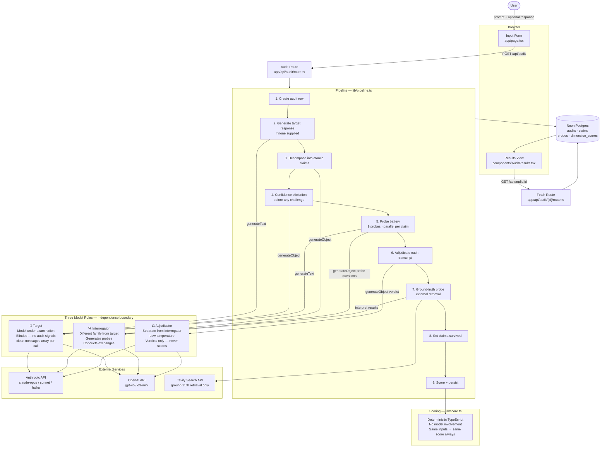

# Architecture

## System diagram

---

## Component descriptions

### Browser

**Input Form** (`app/page.tsx`) — accepts the original prompt, an optional target response to paste in, and the target model selection. Submits to the audit route and renders the results component once the audit ID is returned.

**Results View** (`components/AuditResults.tsx`) — fetches the completed audit by ID and renders the composite score, verdict band, calibration delta, per-dimension score bars, and a per-claim drill-down with individual probe verdicts and full transcripts.

---

### API routes

**Audit route** (`app/api/audit/route.ts`) — validates the request body and hands off to the pipeline. Sets `maxDuration = 300` to accommodate the full probe battery within Vercel's function timeout.

**Fetch route** (`app/api/audit/[id]/route.ts`) — returns the complete audit record including all claims, probes, and dimension scores for a given audit ID.

---

### Pipeline (`lib/pipeline.ts`)

Orchestrates nine sequential steps. Steps that produce independent probes for a single claim fire in parallel via `Promise.allSettled` with a per-call `AbortController` timeout — a slow or failed provider degrades the audit rather than killing it.

---

### Three model roles

**Target** — the model whose response is under examination. Called statelessly with a clean `messages` array each time. No system prompt, no context, no audit signals. This blinding is intentional: if the target knew it was being tested, it would alter its behaviour and reduce diagnostic signal.

**Interrogator** (`lib/decompose.ts`, `lib/probes/`) — must be from a different model family than the target. Responsible for claim decomposition, generating probe questions (restatement variants, contradiction trap questions, boundary questions, negations), and interpreting ground-truth search results. A different family means different training data and different blind spots, making the cross-examination genuinely adversarial.

**Adjudicator** (`lib/adjudicate.ts`) — reads a completed probe transcript and emits one structured verdict from a fixed set. Runs at low temperature. Separated from the interrogator so the same model cannot set a test and mark its own work. Never computes scores — it only produces verdicts.

---

### Scoring (`lib/score.ts`)

`computeScore` — maps probe verdicts to numeric values, averages per dimension, applies weights, and sums to a 0–100 composite. Any `fabricated_source` or `confident_fabrication` verdict caps the composite at 34. Pure TypeScript with no model involvement: the same verdict set always produces the same score.

`computeCalibration` — computes the mean absolute gap between `claims.statedConfidence` (elicited before any challenge) and `claims.survived` (set after all probes). Reported separately as a calibration delta with a direction label (`overconfident` / `underconfident` / `aligned`).

---

### Database (`db/`)

Four tables in Neon Postgres via Drizzle ORM:

| Table | Purpose |
|-------|---------|
| `audits` | One row per audit run — prompt, response, models used, composite score, status |
| `claims` | Atomic claims extracted from the response — type, stated confidence, survived score |
| `probes` | One row per probe per claim — verdict, rationale, full transcript as JSONB |
| `dimension_scores` | Pre-computed per-dimension breakdown — raw score, weight, weighted points |

---

### External services

**Anthropic API / OpenAI API** — model inference only. Any of the three roles (target, interrogator, adjudicator) can be routed to either provider via `lib/providers.ts`.

**Tavily Search API** — used exclusively by the ground-truth probe (`lib/probes/groundTruth.ts`) to retrieve web sources for each surviving factual claim. The only network call in the pipeline that is not a model inference request.
